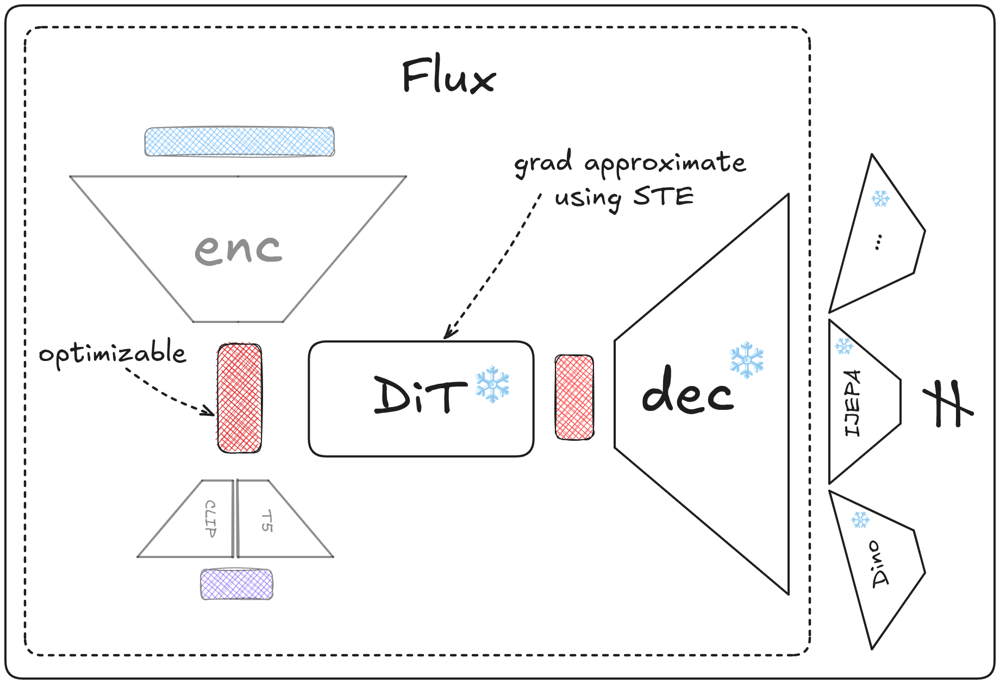
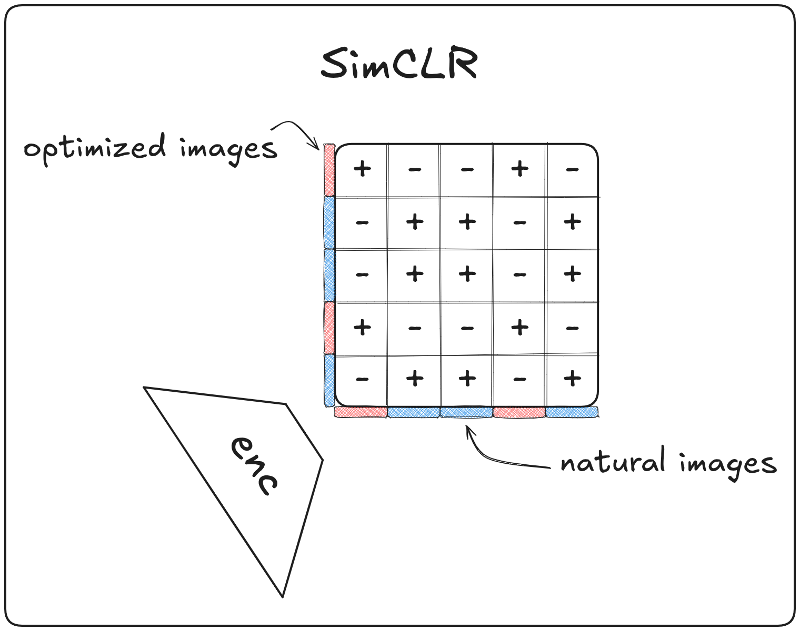
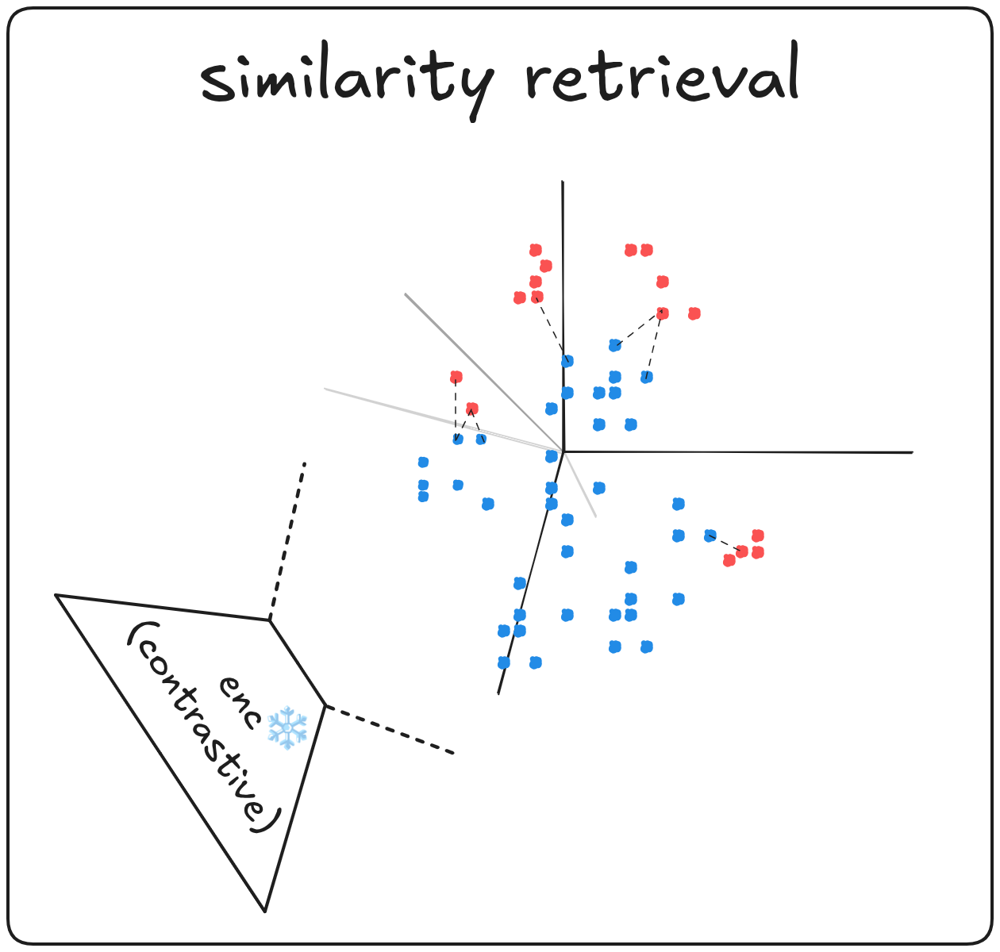
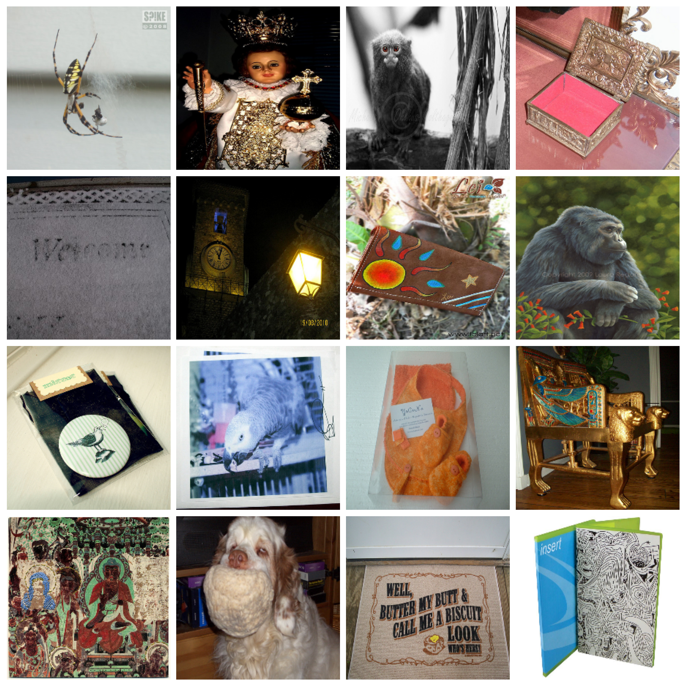

# Controversial-Latents
inspired by the Re-Align challenge & workshop (ICLR'26) this repo explores generating images that maximize latent representation divergence (high semantic features) across multiple vision models

# Description
this repo exploring images, low and high level visual features, that maximize inter- and intra- models latent representations divergence across multiple vision models

through a modular control using the config files the following pipeline is ultimately implementated: 

- optimize latent input to a differentiable visual semantics prior that maximize the objective, measured by representation divergence (CKA)
- train a contrastive model to tell apart optimized and natural images
- retrieve natural images most similar to the optimized ones in the latter contrastive space

# Pipeline & Samples

### Phase 1: Optimizing Images

using Flux as a generative visual prior to generate images that maximize the prior while being semantically valid by optimizing both the seed noise and text / prompt conditioning vectors and using an STE (straight through estimator) for mem capacity during training

   
  <em>Flux as a generative prior</em>

### Phase 2: Fake vs Real through Contrastive SSL

a SimCLR style head is trained on top of a vision model to differentiate optimized and natural images. samples below show outputs from both the flux-guided prior and the ensemble variant, where pure noise optimization yields lower-level feature maps in the absence of any semantic structure

<table>
  <tr>
    <td width="50%" align="center">
       
      <em>SimCLR fake vs real</em>
    </td>
    <td width="50%" valign="top" align="center">
       
      <em>flux prior optimized samples</em>
        
       
      <em>ensemble prior (starting from pure noise) optimized samples</em>
    </td>
  </tr>
</table>

### Phase 3: Natural Images Retrieval

using representations of both natural and optimized images we retrieve the topk images most confusing to the contrastive head. retrieved natural images from the ImageNet validation split mostly display the same visual features and structures, and are in themselves mostly confusing at first glance

<table>
  <tr>
    <td width="50%" align="center">
       
      <em>fake and real in contrastive space</em>
    </td>
    <td width="50%" align="center">
       
      <em>samples from topk retrieved natural images</em>
    </td>
  </tr>
</table>
